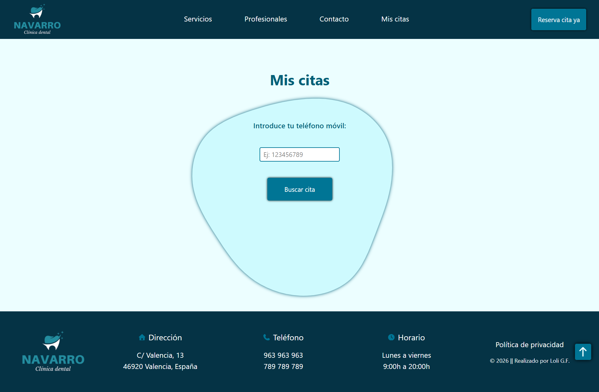
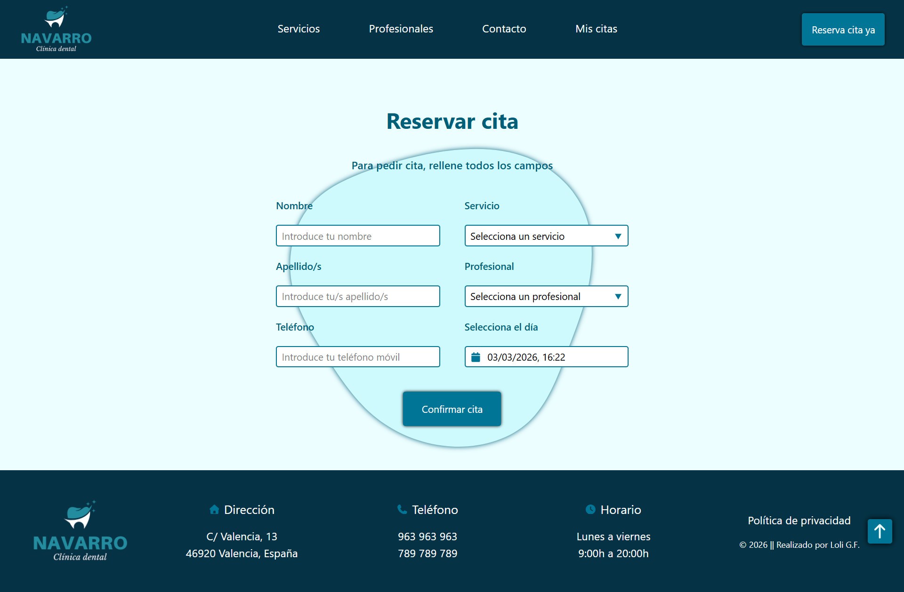
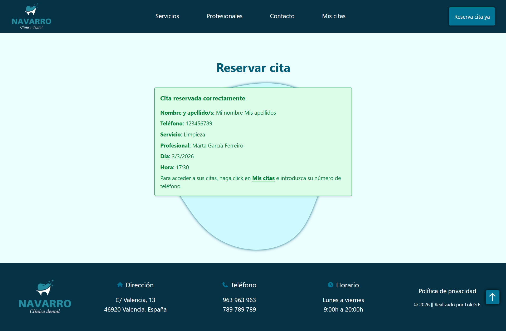
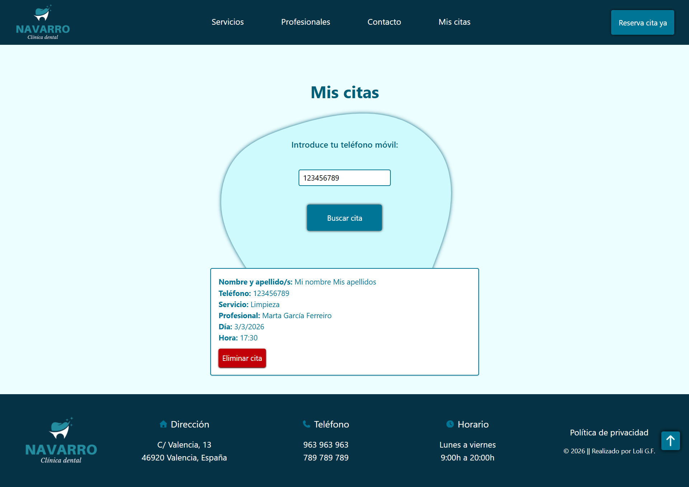

# Clínica dental con React + Tailwind

Este proyecto trata sobre una clínica dental ficticia desarrollada en **React 19.2** y diseñada con **Tailwind 4.2**.

La web tiene componentes donde se muestra la información de los servicios, profesionales, CTA, reseñas, contacto, menú de navegación y footer.

## Características principales

- Reserva de citas con validación completa  
- Calendario personalizado con horarios reales  
- Filtrado dinámico de profesionales  
- Gestión de citas en localStorage  
- Eliminación de citas  
- Slider de reseñas con Swiper 
- Diseño responsive con Tailwind  

## Componentes

- **Menú de navegación** con las secciones: Servicios, Profesionales, Contacto, Mis Citas y un botón para reservar cita.
- **Hero section** con el encabezado *h1*, un botón para reservar cita y una imagen ( excepto en modo móvil ).
- **Servicios** y **ServiciosCard**: se muestran los servicios que ofrecen a través de unas cards, con una imagen, icono, título y texto.
- **CTA**: efecto parallax con una imagen, fondo por encima de ésta y un botón para reservar cita.
- **Profesionales** y **ProfesionalesCard**: se muestran los dos profesionales a través de unas cards, con la imagen, nombre y apellidos, número colegiada/o, especialización, lugar de estudios y años de experiencia.
- **Reviews**, **ReviewsCard** y **RatingStars**: se muestran en un slider 6 reseñas ficticias, con imagen, nombre y apellido/s, valoración y texto de la experiencia.
- **Contacto**: información con el horario, dirección, teléfonos y el mapa de Google Maps mostrando la dirección.
- **Footer**: con la información de la clínica como el logo, dirección, teléfonos, horario, política de privacidad y copyright. 

## Data

Aquí se encuentran los datos de:

- Profesionales: id, imagenAVIF, imagenWEBP, imagen, alt, nombre, número de colegiada/o, las tres especializaciones, lugar de estudios, experiencia y un array de los servicios que atiende.
- Reviews: id, imagen, alt, nombre, texto y rating.
- Servicios: id, imagenAVIF, imagenWEBP, imagen, alt, icono, título y descripción del servicio.
- Servicios para seleccionar al reservar cita: id, nombre y el ID del profesional.

## Pages

En esta carpeta se encuentran las páginas de *Home*, *MisCitas* y *ReservarCita*

- Home: se muestran los componentes hero-section, servicios, CTA, profesionales, reviews y contacto.

- Mis citas: se muestra una pantalla para escribir el número de teléfono que se ha registrado para pedir cita.

- Reservar cita: se muestra un formulario en el que hay que introducir los datos para pedir cita.

## Tecnologías

- React 19.2
- React Router DOM
- React DatePicker
- date-fns
- Swiper
- Tailwind CSS 4.2

### Librerías

#### Swiper

Para las reseñas se ha usado la libería **Swiper** en la que se recogen los datos de la carpeta *data* y se accede a ellos a través de la función map que recorre el array de los datos. 
Se le han dado estilos en CSS, para que según el dispositivo desde el que se vea, aparezca una card, dos o tres.

#### React DatePicker

Para el calendario que aparece en el formulario, se ha usado **React DatePicker**.
- Se ha personalizado para que aparezcan las horas de la clínica ( a partir de las 9:00h y la última a las 19:30h ) dejando la última media hora desactivada ( 20:00h ).
- Hay un intervalo de 30 minutos.
- El calendario y las horas están actualizadas para España, usando `import DatePicker, { registerLocale } from 'react-datepicker';` y `import es from 'date-fns/locale/es';` y registrando el calendario para el horario español `registerLocale('es', es);`
- Deshabilitando el sábado y domingo del calendario, filtrando los días `filterDate={(date) => date.getDay() !== 6 && date.getDay() !== 0}`
- Se filtran las horas que ya han pasado, para que no puedan seleccionarse 
`const filtrarHorasPasadas = (time) => { const ahora = new Date(); const fechaSeleccionada = fecha; if (fechaSeleccionada.toDateString() === ahora.toDateString()) { return ahora.getTime() < time.getTime();} return true;};` y en el componente `filterTime={filtrarHorasPasadas}`

## Lógica

### Formulario Reservar Cita

- Uso de estados con `useState` para tener control sobre los input del formulario: nombre, apellido/s, teléfono, servicio, profesional, fecha, hora y mensaje.
- Uso de la librería *React DatePicker* para seleccionar el día y hora de la cita.
- Función para filtrar las horas pasadas para que no aparezcan en el calendario.
- Filtro de profesionales según el servicio elegido.
- Guardado de las citas en localStorage.
- Mensaje de confirmación de la cita con los datos aportados al reservar.
- Uso de *onSubmit* con la función *manejarSubmit* del localStorage
- Inputs para introducir los datos: nombre, apellido/s, teléfono, servicio, profesional y calendario de fecha y hora. Y el botón para enviar el formulario.

### Mis citas

- Uso de estados con `useState` para el teléfono de búsqueda, citas y mensaje de error.
- Función para obtener las citas guardadas en localStorage y si no hay ninguna, mostrar un mensaje de error.
- Función para filtrar las citas guardadas por orden de fecha, desde la más próxima.
- Función para eliminar una cita, mostrando las citas guardadas, actualizando, filtrando las más próximas y si no quedan más citas, mostrar un mensaje.
- Las citas se muestran a través de map, que recorre el array de citas.

## Capturas de pantalla

### Home

### Reservar cita

 

### Mis Citas

 

## Bibliografía

- [React](https://es.react.dev/)
- [Instalación Tailwind en React con Vite](https://tailwindcss.com/docs/installation/using-vite)
- [Swiper](https://swiperjs.com/react)
- [Info React DatePicker](https://reactdatepicker.com/)

## Instalación y ejecución

1. Clonar el repositorio:
`git clone https://github.com/loli-digital/calendario-dentista-react.git`

2. Instalar dependencias
`npm install`

3. Ejecutar
`npm run dev`

---

## React + Vite

This template provides a minimal setup to get React working in Vite with HMR and some ESLint rules.

Currently, two official plugins are available:

- [@vitejs/plugin-react](https://github.com/vitejs/vite-plugin-react/blob/main/packages/plugin-react) uses [Babel](https://babeljs.io/) (or [oxc](https://oxc.rs) when used in [rolldown-vite](https://vite.dev/guide/rolldown)) for Fast Refresh
- [@vitejs/plugin-react-swc](https://github.com/vitejs/vite-plugin-react/blob/main/packages/plugin-react-swc) uses [SWC](https://swc.rs/) for Fast Refresh

## React Compiler

The React Compiler is currently not compatible with SWC. See [this issue](https://github.com/vitejs/vite-plugin-react/issues/428) for tracking the progress.

## Expanding the ESLint configuration

If you are developing a production application, we recommend using TypeScript with type-aware lint rules enabled. Check out the [TS template](https://github.com/vitejs/vite/tree/main/packages/create-vite/template-react-ts) for information on how to integrate TypeScript and [`typescript-eslint`](https://typescript-eslint.io) in your project.
